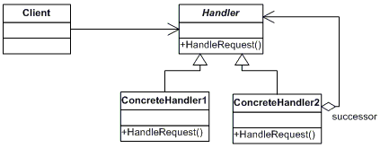

#Chain of Responsibility

**Chain of Responsibility**  представлява **Behavioral Patterns**, един от трите типа **Design Pattern** (шаблони).

* __Дефиниция__:
    При разработката на различни проекти в много от случаите се налага някое събитие генерирано от даден обект да бъде обработено от друг обект.

    -	__Chain of Responsibility Pattern__ позволява да се предава заявка за обработване от един обект на следващ,  докато тя не бъде обработена. 
    -	__Шаблонът__ се състои се от сортиран лист от обекти, които  обработват дадената заявка. 
    -	Взаимовръзката на обектите е значително опростена – защото всеки обект пази референция към следващия. 
    -	Наподобяват процеса при  __Exception handling__.
    -	__Шаблонът__ се характерезира с  дървовидна структура от отговорностите.
    -	Като недостатък се счита риска от лесно "счупване", при отсъствие на  връзка за следващия __Handler__ на дадена заявка
    
* __Цел__:

    При изпращане на заявката, подавача знае само за първия обект от веригата, всеки един обработваш обект знае за следващия. При получаване на заявка дадения обект я обработва или препредава по веригата. Първият обект, който успешно обработи заявката, приключва работата на структурата от обекти.

* __Употреби:__

  **Chain of Responsibility Pattern** се използва в случайте, когато трябва да изпратим заявка, но не сме наясно, кой обект точно би могъл да я обработи коректно.  В подобни ситуации позлваме този шаблон, който осигурява пращане на заявката към лист от обекти, взаймосвързани чрез референции и структорирани в дървовидна структура. Заявката се прехвърля от даден обект, последователно на друг такъв, който се опитва да я обработи. Този процес се преповтаря, докъто заявката не бъде обработена успешно.

* __Диаграма__:

 
 
 * __Имплементация__:
 
~~~c#

using System;
 
namespace DoFactory.GangOfFour.Chain.Structural
{
  /// 

  /// MainApp startup class for Structural
  /// Chain of Responsibility Design Pattern.
  /// 

  class MainApp
  {
    /// 

    /// Entry point into console application.
    /// 

    static void Main()
    {
      // Setup Chain of Responsibility
      Handler h1 = new ConcreteHandler1();
      Handler h2 = new ConcreteHandler2();
      Handler h3 = new ConcreteHandler3();
      h1.SetSuccessor(h2);
      h2.SetSuccessor(h3);
 
      // Generate and process request
      int[] requests = { 2, 5, 14, 22, 18, 3, 27, 20 };
 
      foreach (int request in requests)
      {
        h1.HandleRequest(request);
      }
 
      // Wait for user
      Console.ReadKey();
    }
  }
 
  /// 

  /// The 'Handler' abstract class
  /// 

  abstract class Handler
  {
    protected Handler successor;
 
    public void SetSuccessor(Handler successor)
    {
      this.successor = successor;
    }
 
    public abstract void HandleRequest(int request);
  }
 
  /// 

  /// The 'ConcreteHandler1' class
  /// 

  class ConcreteHandler1 : Handler
  {
    public override void HandleRequest(int request)
    {
      if (request >= 0 && request < 10)
      {
        Console.WriteLine("{0} handled request {1}",
          this.GetType().Name, request);
      }
      else if (successor != null)
      {
        successor.HandleRequest(request);
      }
    }
  }
 
  /// 

  /// The 'ConcreteHandler2' class
  /// 

  class ConcreteHandler2 : Handler
  {
    public override void HandleRequest(int request)
    {
      if (request >= 10 && request < 20)
      {
        Console.WriteLine("{0} handled request {1}",
          this.GetType().Name, request);
      }
      else if (successor != null)
      {
        successor.HandleRequest(request);
      }
    }
  }
 
  /// 

  /// The 'ConcreteHandler3' class
  /// 

  class ConcreteHandler3 : Handler
  {
    public override void HandleRequest(int request)
    {
      if (request >= 20 && request < 30)
      {
        Console.WriteLine("{0} handled request {1}",
          this.GetType().Name, request);
      }
      else if (successor != null)
      {
        successor.HandleRequest(request);
      }
    }
  }
}

~~~

Link [on WebSite](https://msdn.microsoft.com/en-us/library/orm-9780596527730-01-04.aspx).
