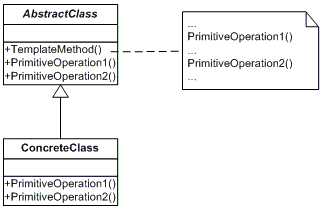

#Template Method

**Template Method**  представлява **Behavioral Patterns**, един от трите типа **Design Pattern** (шаблони).

* __Дефиниция__:
    *	__Template Method Pattern__ дефинира основата на даден алгоритъм, като оставя част от имплементация на дадените методи на подкласовете (наследниците)
    * Шаблонът осигурява възможност на наследниците да предефинират имплементацията на част от методите, без да се нарушава структурата на алгоритъма.
    *	__Шаблонният метод__ позволява разделянето на алгоритма и имплементацията му на две отделни нива.
    * Логиката на алгоритъма е реализирана в базов родителски клас, а наследниците предефинират имплементацията на заложените методи.

* __Цел__:

    Шаблонът **Template Method** се използва, когато имаме даден алгоритъм, изпълняващи дадена задача в определена последователност.
    Част от стъпките биха могли да се изпълняват по различен начин в зависимост от имплементацията.

* __Употреби:__

    Използването на __Тemplate Method__ осигурява скелет на даден алгоритъм при определена операция, като се предоставят стъпки за имплементиране от подкласове.
  Наследниците предефинират някои методи, без да нарушават цялостната структура на алгоритъма.

* __Компоненти:__
    - **AbstractClass**: тип клас, който се състои от два възможни вида методи. Отделните стъпки на алгоритъма и от друга страна самият шаблонен метод.
    - **ConcreteClass**: вид клас, който съдържа специфичната имплементация на методите - стъпки от алгоритъма, декларирани като абстрактни в базовия клас.

* __Диаграма__:

 
 
 * __Имплементация__:
 
~~~c#

using System;
 
namespace DoFactory.GangOfFour.Template.Structural
{
  /// 

  /// MainApp startup class for Real-World 
  /// Template Design Pattern.
  /// 

  class MainApp
  {
    /// 

    /// Entry point into console application.
    /// 

    static void Main()
    {
      AbstractClass aA = new ConcreteClassA();
      aA.TemplateMethod();
 
      AbstractClass aB = new ConcreteClassB();
      aB.TemplateMethod();
 
      // Wait for user
      Console.ReadKey();
    }
  }
 
  /// 

  /// The 'AbstractClass' abstract class
  /// 

  abstract class AbstractClass
  {
    public abstract void PrimitiveOperation1();
    public abstract void PrimitiveOperation2();
 
    // The "Template method"
    public void TemplateMethod()
    {
      PrimitiveOperation1();
      PrimitiveOperation2();
      Console.WriteLine("");
    }
  }
 
  /// 

  /// A 'ConcreteClass' class
  /// 

  class ConcreteClassA : AbstractClass
  {
    public override void PrimitiveOperation1()
    {
      Console.WriteLine("ConcreteClassA.PrimitiveOperation1()");
    }
    public override void PrimitiveOperation2()
    {
      Console.WriteLine("ConcreteClassA.PrimitiveOperation2()");
    }
  }
 
  /// 

  /// A 'ConcreteClass' class
  /// 

  class ConcreteClassB : AbstractClass
  {
    public override void PrimitiveOperation1()
    {
      Console.WriteLine("ConcreteClassB.PrimitiveOperation1()");
    }
    public override void PrimitiveOperation2()
    {
      Console.WriteLine("ConcreteClassB.PrimitiveOperation2()");
    }
  }
}

~~~

Link [on WebSite](https://msdn.microsoft.com/en-us/library/orm-9780596527730-01-04.aspx).
