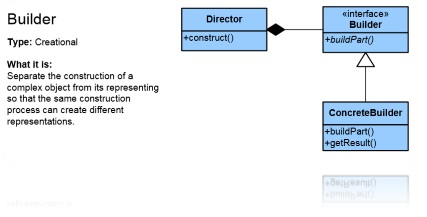

#Builder

**Builder** представлява **Creational Pattern**, един от трите типа **Design Pattern** (шаблон).

* __Дефиниция:__
    * __Builder Pattern__ служи за създаване на обекти и разделя логиката по създаването от използването му. По този начин един и същ процес на конструиране може да създаде различни обекти.
    * Шаблонът позволява енкапсулация и опростява създаването на обекта. Благодарение на него се избяга подаване на голям брой параметри, order dependency и множество конструктори.
    * __Builder__ си служи с Director, абстрактен Builder (определя логиката по създаването, последователността) и конкретен Builder, който отговаря за конкретната имплементация на създаването
    * Различните компоненти са взаимно зависими, което налага определена последователност при инициализирането им. Създаването на различните компоненти се осъществява чрез методи, които са дефинирани в интерфейс. Това позволява на всеки наследник на съответния интерфейс да имплементира по свой начин създаването на компонентите.
    * Създава се на клас, който определя необходимите компоненти и последователността на създаването им.
    * Можем да имаме различни имплементации на методологиите за създаване на компоненти, така можем да имаме и различни имплементации за композирането им.

* __Цел__:
    * Builder Pattern се използва с цел създаване на обекти, с определена последователност на инициализиране на различните компоненти на обекта.
    
* __Употреби:__
    * HTML докимент
	
* __Диаграма__:

 
    
#####Builder Pattern пример:
~~~c#
using System;
using System.Collections.Generic;
 
namespace DoFactory.GangOfFour.Builder.Structural
{
  /// 

  /// MainApp startup class for Structural
  /// Builder Design Pattern.
  /// 

  public class MainApp
  {
    /// 

    /// Entry point into console application.
    /// 

    public static void Main()
    {
      // Create director and builders
      Director director = new Director();
 
      Builder b1 = new ConcreteBuilder1();
      Builder b2 = new ConcreteBuilder2();
 
      // Construct two products
      director.Construct(b1);
      Product p1 = b1.GetResult();
      p1.Show();
 
      director.Construct(b2);
      Product p2 = b2.GetResult();
      p2.Show();
 
      // Wait for user
      Console.ReadKey();
    }
  }
 
  /// 

  /// The 'Director' class
  /// 

  class Director
  {
    // Builder uses a complex series of steps
    public void Construct(Builder builder)
    {
      builder.BuildPartA();
      builder.BuildPartB();
    }
  }
 
  /// 

  /// The 'Builder' abstract class
  /// 

  abstract class Builder
  {
    public abstract void BuildPartA();
    public abstract void BuildPartB();
    public abstract Product GetResult();
  }
 
  /// 

  /// The 'ConcreteBuilder1' class
  /// 

  class ConcreteBuilder1 : Builder
  {
    private Product _product = new Product();
 
    public override void BuildPartA()
    {
      _product.Add("PartA");
    }
 
    public override void BuildPartB()
    {
      _product.Add("PartB");
    }
 
    public override Product GetResult()
    {
      return _product;
    }
  }
 
  /// 

  /// The 'ConcreteBuilder2' class
  /// 

  class ConcreteBuilder2 : Builder
  {
    private Product _product = new Product();
 
    public override void BuildPartA()
    {
      _product.Add("PartX");
    }
 
    public override void BuildPartB()
    {
      _product.Add("PartY");
    }
 
    public override Product GetResult()
    {
      return _product;
    }
  }
 
  /// 

  /// The 'Product' class
  /// 

  class Product
  {
    private List<string> _parts = new List<string>();
 
    public void Add(string part)
    {
      _parts.Add(part);
    }
 
    public void Show()
    {
      Console.WriteLine("\nProduct Parts -------");
      foreach (string part in _parts)
        Console.WriteLine(part);
    }
  }
}
~~~

Link [on WebSite](https://msdn.microsoft.com/en-us/library/orm-9780596527730-01-05.aspx).
