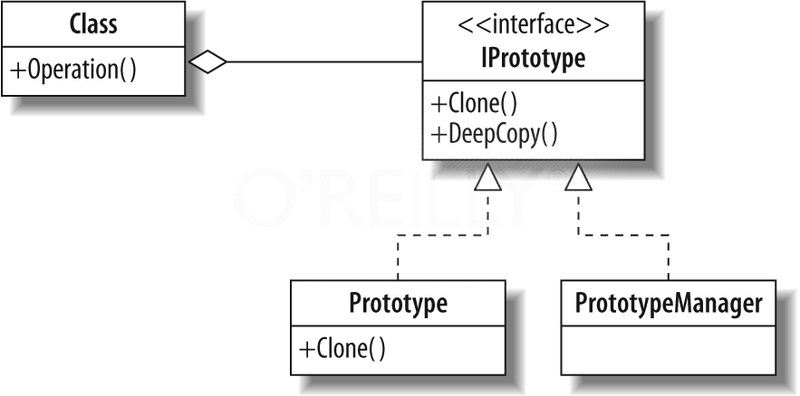

#Prototype

**Prototype Pattern** представлява **Creational Pattern**, един от трите типа **Design Pattern** (шаблон).

* __Дефиниция:__
    *	Prototype Pattern служи за създаване на инстанции на даден клас чрез клониране на вече съществуващ обект.
    * Прототипът се използва, когато създаването на нова инстанция от даден клас отнема много време или усилия или за да се избегне сложна йерархия от класове тип Фабрика и съответните ѝ класове-продукти.
    * Шаблонът е удобен и се използва, когато класовете за инстанциране се определят по време на изпълнение и състоянията на инстанциите на даден клас могат да са в определен брой комбинации.

* __Цел__:
    * Prototype Pattern се използва с цел създаване на нови обекти, като клонира вече съществуващи такива.

* __Употреби:__
    * клониране на всякакви обекти, данни и т.н.
    
* __Компоненти::__
    * __Prototype__: Абстрактен базов клас от обекти, които могат да бъдат клонирани. Класът съдържа единствен виртуален метод Clone(), който връща обект-прототип. .NET включва интерфейс ICloneable, който създава нова инстанция от даден клас със същата стойност като съществуващата инстанция.
    * __ConcretePrototype__: Този клас наследява базовия клас Prototype и съдържа допълнителна функционалност, като в същото време оувъррайдва метода Clone().

	
* __Диаграма__:

 
	
#####Prototype Pattern пример:
~~~c#
	using System;
 
namespace DoFactory.GangOfFour.Prototype.Structural
{
  /// 

  /// MainApp startup class for Structural
  /// Prototype Design Pattern.
  /// 

  class MainApp
  {
    /// 

    /// Entry point into console application.
    /// 

    static void Main()
    {
      // Create two instances and clone each
 
      ConcretePrototype1 p1 = new ConcretePrototype1("I");
      ConcretePrototype1 c1 = (ConcretePrototype1)p1.Clone();
      Console.WriteLine("Cloned: {0}", c1.Id);
 
      ConcretePrototype2 p2 = new ConcretePrototype2("II");
      ConcretePrototype2 c2 = (ConcretePrototype2)p2.Clone();
      Console.WriteLine("Cloned: {0}", c2.Id);
 
      // Wait for user
      Console.ReadKey();
    }
  }
 
  /// 

  /// The 'Prototype' abstract class
  /// 

  abstract class Prototype
  {
    private string _id;
 
    // Constructor
    public Prototype(string id)
    {
      this._id = id;
    }
 
    // Gets id
    public string Id
    {
      get { return _id; }
    }
 
    public abstract Prototype Clone();
  }
 
  /// 

  /// A 'ConcretePrototype' class 
  /// 

  class ConcretePrototype1 : Prototype
  {
    // Constructor
    public ConcretePrototype1(string id)
      : base(id)
    {
    }
 
    // Returns a shallow copy
    public override Prototype Clone()
    {
      return (Prototype)this.MemberwiseClone();
    }
  }
 
  /// 

  /// A 'ConcretePrototype' class 
  /// 

  class ConcretePrototype2 : Prototype
  {
    // Constructor
    public ConcretePrototype2(string id)
      : base(id)
    {
    }
 
    // Returns a shallow copy
    public override Prototype Clone()
    {
      return (Prototype)this.MemberwiseClone();
    }
  }
}

~~~

Link [on WebSite](https://msdn.microsoft.com/en-us/library/orm-9780596527730-01-05.aspx).
