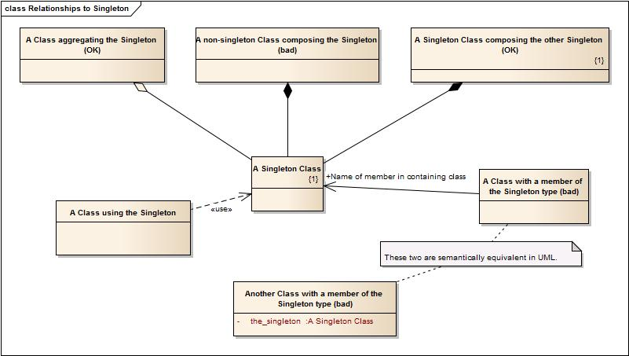

#Singleton

**Singleton** представлява **Creational Pattern**, един от трите типа **Design Pattern** (шаблон).

* __Дефиниция:__
    * Сек (Singleton) е т. нар. създаващ шаблон за дизайн, който се използва в обектно-ориентираното програмиране. Този шаблон се използва обикновено в моделирането на обекти, които трябва да бъдат глобално достъпни за обектите на приложението или обекти, които се нуждаят от максимално късна инициализация за пестенето на ресурси от паметта. Шаблонът Сингълтън е един от най-добре познатите шаблони в софтуерното инженерство. Той представя ограничението на клас до един обект и възможност да бъде създадена една единствена инстанция, като осугурява достъп до нея. Най-често тези класове не позволяват да се задават параметри при създаването на инстанцията . Обичайното изискване за Сингълтън инстанцията е тя да бъде създавана при нужда чрез т.нар. lazy loading, т.е. инстанцирането да се случва само, когато за първи път има нужда от инстанцията.
Използва се за неща, които са глобални и единствени за приложението. 
__Singleton__ нарушава някой от ООП принципи (и SOLID single responsibility). Затова този патърн  понякога носи със себе си проблеми за отстраняване.
    
* __Цел__:
    * Шаблонът се използва, за да подсигури, че от даден клас може да бъде създадена една единствена инстанция.
При нужда от допълнителни обекти от класа, се връща първоначално създадената единствена инстанция.
Достъпването на класа от много нишки едновременно е предпоставка за проблем, затова се използва thread-safe имплементация.

* __Приложение:__
    * Highscore (в игрите)
    * file system
    
* __Употреби:__
    * window manager, file system, logger
	
	
* __Диаграма__:

 
 
 
    
* __Имплементация:__ 

~~~c#
	using System;
	 
	namespace Singleton.Structural
	{
	  class MainApp
	  {
	    static void Main()
	    {
	      Singleton s1 = Singleton.Instance();
	      Singleton s2 = Singleton.Instance();
	 
	      // Test for same instance
	      if (s1 == s2)
	      {
	        Console.WriteLine("Objects are the same instance");
	      }
	 
	      Console.ReadKey();
	    }
	  }
  	}
~~~

#####Singleton с използване на Lazy<T>:
~~~c#
public sealed class Singleton
{
    private static readonly Lazy<Singleton> lazy =
        new Lazy<Singleton>(() => new Singleton());

    public static Singleton Instance { get { return lazy.Value; } }

    private Singleton()
    {
    }
}
~~~

#####Singleton с използване на двойно заключване:
~~~c#
public sealed class Singleton
{
    private static Singleton instance = null;
    private static readonly object padlock = new object();

    private Singleton()
    {
    }

    public static Singleton Instance
    {
        get
        {
            if (instance == null)
            {
                lock (padlock)
                {
                    if (instance == null)
                    {
                        instance = new Singleton();
                    }
                }
            }
            return instance;
        }
    }
}

~~~

Link [on WebSite](https://msdn.microsoft.com/en-us/library/orm-9780596527730-01-05.aspx).

