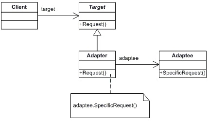

# Adapter

**Adapter** представлява **Structural Patterns**, един от трите типа **Design Pattern** (шаблон).

*  __Дефиниция:__
    * __Adapter Pattern__ представлява шаблон, който се използва в обектно-ориентираното програмиране.
    * __Adapter__ значително улеснява преизползването на съществуващ код.
    * __Шаблонът__ преобразува интерфейса на даден клас, с цел лесно да бъде използван от клиента.
    * Осигурява възможност за съвместна работа между класове с несъвместими интерфейси.
    * В различни случай Adapter Pattern се нарича още **wrapper** и **translator**.
    
* __Цел__:
    * __Шаблонът__ се ползва с цел повторно използване на вече съществуващ код.
    * Позволява съвместна работа между класове с несъвместими интерфейси.
    
* __Компоненти:__
    * __Target__: представлява специфичния интерфейс, използван от клиентът.
    * __Adapter__: адаптира интерфейса **Adaptee** към интерфейса **Target** и осигурява възможност за съвместна работа.
    * __Adaptee__: представлява съществуващ интерфейс,  върху който се налага адаптиране.
    * __Client__: обект или група обекти, който са наседници на интерфейса **Target**.
    
* __Диаграма__:

 
 
 * __Имплементация__:
 
~~~c#

interface ITarget
{
  List<string> GetProducts();
}

public class VendorAdaptee
{
   public List<string> GetListOfProducts()
   {
      List<string> products = new List<string>();
      products.Add("Gaming Consoles");
      products.Add("Television");
      products.Add("Books");
      products.Add("Musical Instruments");
      return products;
   }
}

class VendorAdapter:ITarget
{
   public List<string> GetProducts()
   {
      VendorAdaptee adaptee = new VendorAdaptee();
      return adaptee.GetListOfProducts();
   }
}

class ShoppingPortalClient
{
   static void Main(string[] args)
   {
      ITarget adapter = new  VendorAdapter();
      foreach (string product in adapter.GetProducts())
      {
        Console.WriteLine(product);
      }
      Console.ReadLine();
   }
}
~~~

Link [on WebSite](https://msdn.microsoft.com/en-us/library/orm-9780596527730-01-04.aspx).
